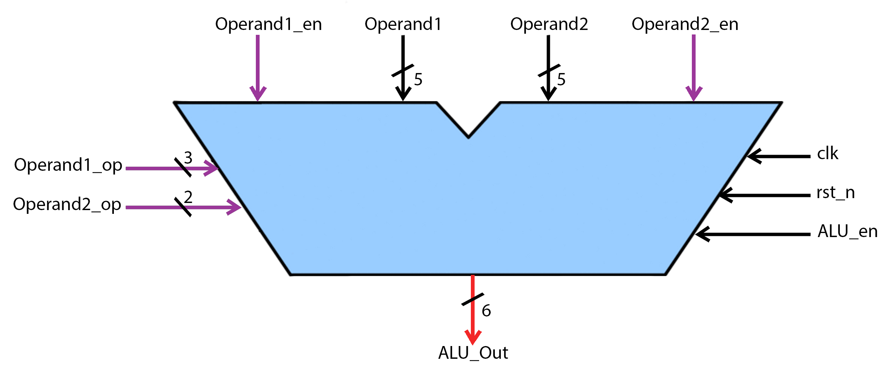

# ALU Design and Verification using UVM

>This project implements and verifies an Arithmetic Logic Unit (ALU) using Universal Verification Methodology (UVM). The ALU performs various arithmetic and logical operations with comprehensive UVM-based verification.

## 📖 Table of Contents
- **ALU Design**: `Module Interface` `State Machine Architecture` `Special Handling` `Output Waveform`
- **UVM Environment**: `UVM Environment diagram` `Test` `Results` `Coverage Closure`

## ⚙️ ALU Design
This is a configurable Arithmetic Logic Unit (ALU) implemented in SystemVerilog using a Finite State Machine (FSM) architecture. The ALU performs various arithmetic and logical operations on two input operands based on control signals and operation codes.

### 🔷Module Interface

   

>##### Parameters
| Parameter     | Type    | Default | Description                     |
|--------------|---------|---------|---------------------------------|
| `Data_Width` | integer | 5       | Bit width of input operands     |

>##### Input Ports
| Signal         | Direction | Width       | Type    | Description                          |
|----------------|-----------|-------------|---------|--------------------------------------|
| `clk`          | input     | 1           | wire    | System clock                         |
| `rst_n`        | input     | 1           | wire    | Active-low asynchronous reset        |
| `ALU_en`       | input     | 1           | wire    | Master enable for ALU operations     |
| `Operand1_en`  | input     | 1           | wire    | Enable for Operand1 operations       |
| `Operand2_en`  | input     | 1           | wire    | Enable for Operand2 operations       |
| `Operand1`     | input     | 5           | wire    | First input operand (signed)         |
| `Operand2`     | input     | 5           | wire    | Second input operand (signed)        |
| `Operand1_op`  | input     | 3           | wire    | Operation code for Operand1 set      |
| `Operand2_op`  | input     | 2           | wire    | Operation code for Operand2 sets     |

>##### Output Ports
| Signal        | Direction | Width       | Type  | Description                     |
|---------------|-----------|-------------|-------|---------------------------------|
| `ALU_output`  | output    | 6           | reg   | ALU result (signed)             |

### 🔷State Machine Architecture
The ALU implements a 4-state Finite State Machine (FSM) that controls all operations which are: 
1- `IDLE State (2'b00)` 
2- `Operand1_set State (2'b01): ADD, SUB, XOR, AND1, AND2, XNOR, OR, NULL` 
3- `Operand2_set1 State (2'b10): NAND, ADD1, ADD2, NULL` 
4- `Operand2_set2 State (2'b11): XOR, XNOR, DEC_Operand1, INC_Operand2` 
>##### Machine State diagram

   

### 🔷Special Handling

* Same-State Output Issue:
  * When staying in the same state, the output is recalculated based on new inputs
  * Prevents output stagnation when performing consecutive operations in the same state

* Bitwise Operation Handling:
  * All bitwise operations (AND, OR, XOR, etc.) are zero-extended to 6 bits
  * MSB is explicitly set to 0 for bitwise results
* Reset Behavior:
  * Asynchronous reset brings the FSM to IDLE state
  * Output is maintained during disabled state (ALU_en=0)

### 🔷Output Waveform

   

## 🧱 UVM Environment
- Complete UVM testbench architecture: `Sequencer, Driver, Monitor Scoreboard Coverage collector Assertion-based checking`
- 8 test sequences covering: `Basic operations` `Edge cases` `MSB handling` `Repeated operations`
- Functional coverage closure: `FSM coverage` `Toggle coverage` `Condition coverage`
### UVM Environment diagram:
This diagram illustrates the Universal Verification Methodology (UVM) testbench architecture for verifying the ALU design.

   

### Tests:
1- **`Initialize_Test`**&nbsp;&nbsp;&nbsp;&nbsp;&nbsp;&nbsp;--> Basic config and sanity check&nbsp;&nbsp;&nbsp;&nbsp;&nbsp;&nbsp;&nbsp;&nbsp;&nbsp;&nbsp;&nbsp;&nbsp;&nbsp;&nbsp;&nbsp;&nbsp;&nbsp;&nbsp;&nbsp;&nbsp;&nbsp;&nbsp;&nbsp;--> run 2 sequences  
2- **`Operand1_set_test`**&nbsp;&nbsp;&nbsp;--> Operand1 operations validation&nbsp;&nbsp;&nbsp;&nbsp;&nbsp;&nbsp;&nbsp;&nbsp;&nbsp;&nbsp;&nbsp;&nbsp;&nbsp;&nbsp;&nbsp;&nbsp;&nbsp;&nbsp;&nbsp;--> run 4 sequences   
3- **`Operand2_set1_test`**&nbsp;&nbsp;--> Operand2 first set operations validation&nbsp;&nbsp;&nbsp;&nbsp;&nbsp;&nbsp;--> run 4 sequences 
4- **`Operand2_set2_test`**&nbsp;&nbsp;--> Operand2 second set operations	validation --> run 4 sequences 

### Results:

